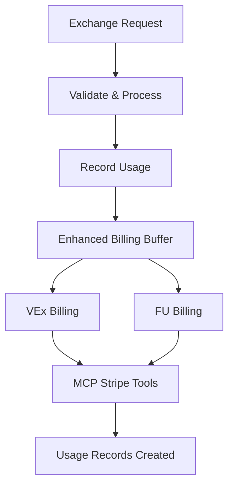
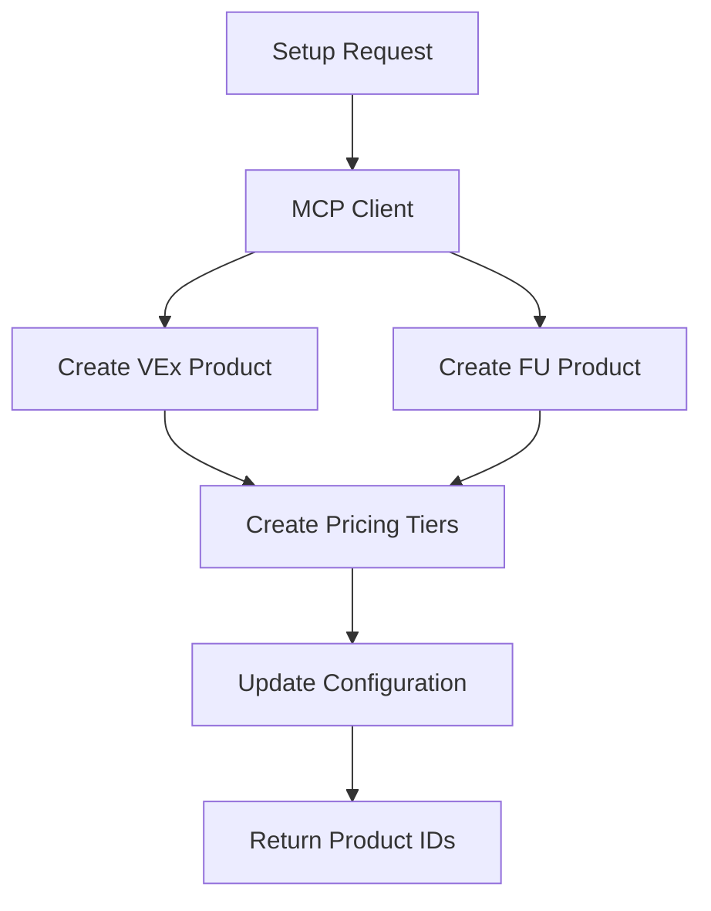

# Stripe MCP Integration with Signet Protocol - Complete Guide

## 🎯 Overview

This guide documents the complete integration of the Stripe Agent Toolkit MCP server with the Signet Protocol billing system. The integration provides enhanced billing capabilities, automated product management, and seamless payment processing.

## 🏗️ Architecture

### Components Added

1. **MCP Server Configuration** (`blackbox_mcp_settings.json`)
   - Stripe Agent Toolkit MCP server
   - Environment-based API key configuration
   - Server name: `github.com/stripe/agent-toolkit`

2. **Enhanced Billing Module** (`server/pipeline/billing_mcp.py`)
   - `StripeMCPClient`: Interface for MCP tool calls
   - `EnhancedBillingBuffer`: Extended billing with MCP capabilities
   - Automated product and pricing setup

3. **API Endpoints** (added to `server/main.py`)
   - `/v1/billing/setup-products`: Create Stripe products via MCP
   - `/v1/billing/create-payment-link/{tenant}`: Generate payment links
   - `/v1/billing/dashboard`: Comprehensive billing dashboard
   - `/v1/billing/sync-stripe-items`: Sync configuration with Stripe

4. **Integration Testing** (`test_mcp_integration.py`)
   - Complete test suite for MCP integration
   - End-to-end billing workflow validation

## 🔧 Configuration

### MCP Server Setup

The Stripe MCP server is configured in `blackbox_mcp_settings.json`:

```json
{
  "mcpServers": {
    "github.com/stripe/agent-toolkit": {
      "command": "npx",
      "args": ["-y", "@stripe/mcp", "--tools=all"],
      "env": {
        "STRIPE_SECRET_KEY": "sk_live_51RuCKsLcPYf7t6os..."
      }
    }
  }
}
```

### Billing Configuration

The system uses `reserved.json` for tenant-specific billing configuration:

```json
{
  "acme": {
    "vex_reserved": 10000,
    "fu_reserved": 50000,
    "vex_overage_tiers": [
      {
        "threshold": 5000,
        "price_per_unit": 0.01,
        "stripe_item": "si_acme_vex_tier1"
      }
    ],
    "fu_overage_tiers": [
      {
        "threshold": 25000,
        "price_per_unit": 0.001,
        "stripe_item": "si_acme_fu_tier1"
      }
    ]
  }
}
```

## 🚀 Available MCP Tools

The integration provides access to comprehensive Stripe functionality:

### Product Management
- `stripe_create_product`: Create new products
- `stripe_list_products`: List existing products
- `stripe_create_price`: Create pricing for products
- `stripe_list_prices`: List all prices

### Customer Operations
- `stripe_list_customers`: List customers
- `stripe_create_customer`: Create new customers

### Payment Processing
- `stripe_create_payment_link`: Generate payment links
- `stripe_create_invoice`: Create invoices
- `stripe_create_refund`: Process refunds
- `stripe_retrieve_balance`: Get account balance

### Subscription Management
- `stripe_list_subscriptions`: List subscriptions
- `stripe_cancel_subscription`: Cancel subscriptions
- `stripe_update_subscription`: Update subscription details

## 📊 Enhanced Billing Features

### 1. Automated Product Setup

```python
# Create VEx and FU products with pricing tiers
result = await BB.setup_signet_products()
```

Creates:
- **VEx Product**: "Signet VEx (Verified Exchange)"
- **FU Product**: "Signet FU (Fallback Units)"
- **Pricing Tiers**: Based on `reserved.json` configuration

### 2. Payment Link Generation

```python
# Generate payment links for tenant subscriptions
payment_link = await BB.create_customer_payment_link("acme", "monthly")
```

Features:
- Tenant-specific pricing
- Monthly/annual billing options
- Metadata tracking for usage analytics

### 3. Billing Dashboard

```python
# Comprehensive billing data
dashboard = await BB.get_billing_dashboard_data()
```

Provides:
- Account balance and status
- Customer list and metrics
- Product and pricing information
- Tenant usage reports
- MCP operation metrics

### 4. Configuration Sync

```python
# Sync Stripe items with local configuration
sync_result = await BB.sync_stripe_items_with_config()
```

Ensures:
- Stripe subscription items match `reserved.json`
- Pricing consistency across systems
- Automated configuration updates

## 🔄 Integration Workflow

### 1. Exchange Processing with Billing



### 2. Product Setup Flow



## 🧪 Testing

### Running Integration Tests

```bash
# Start the Signet Protocol server
python -m server.main

# Run integration tests
python test_mcp_integration.py
```

### Test Coverage

The integration test suite covers:

1. **Health Check**: Server availability
2. **Product Setup**: MCP-based product creation
3. **Payment Links**: Tenant-specific payment generation
4. **Dashboard**: Billing data retrieval
5. **Sync Operations**: Configuration synchronization
6. **Exchange Billing**: End-to-end billing workflow

## 📈 Monitoring & Metrics

### Prometheus Metrics

The integration adds new metrics:

```python
# MCP operation tracking
mcp_operations = Counter("signet_mcp_operations_total", 
                        ["operation", "status"])

# Product creation tracking
stripe_products_created = Counter("signet_stripe_products_created_total")
stripe_prices_created = Counter("signet_stripe_prices_created_total")
```

### Usage Analytics

- VEx (Verified Exchange) operations
- FU (Fallback Units) token consumption
- Overage tier utilization
- MCP tool call frequency

## 🔐 Security Considerations

### API Key Management

- Stripe API keys stored in environment variables
- MCP server isolation with dedicated credentials
- Tenant-specific API key validation

### Data Protection

- Encrypted communication with Stripe APIs
- Audit logging for all billing operations
- Idempotency key protection against duplicate charges

## 🚀 Deployment

### Prerequisites

1. **Stripe Account**: Active account with API keys
2. **Node.js**: For MCP server execution
3. **VS Code/BlackBox**: For MCP client integration

### Setup Steps

1. **Configure MCP Server**:
   ```bash
   # Update blackbox_mcp_settings.json with Stripe API key
   ```

2. **Restart VS Code**: To load MCP configuration

3. **Initialize Products**:
   ```bash
   curl -X POST http://localhost:8000/v1/billing/setup-products \
        -H "X-SIGNET-API-Key: your_api_key"
   ```

4. **Verify Integration**:
   ```bash
   python test_mcp_integration.py
   ```

## 🎯 Usage Examples

### Create Payment Link for Customer

```bash
curl -X POST "http://localhost:8000/v1/billing/create-payment-link/acme?plan_type=monthly" \
     -H "X-SIGNET-API-Key: your_api_key"
```

### Get Billing Dashboard

```bash
curl -X GET "http://localhost:8000/v1/billing/dashboard" \
     -H "X-SIGNET-API-Key: your_api_key"
```

### Process Exchange with Billing

```bash
curl -X POST "http://localhost:8000/v1/exchange" \
     -H "X-SIGNET-API-Key: your_api_key" \
     -H "X-SIGNET-Idempotency-Key: unique_key" \
     -H "Content-Type: application/json" \
     -d '{
       "payload_type": "openai.tooluse.invoice.v1",
       "target_type": "invoice.iso20022.v1",
       "payload": {...}
     }'
```

## 🔮 Future Enhancements

### Planned Features

1. **Real-time MCP Integration**: Direct MCP client library usage
2. **Advanced Analytics**: Usage prediction and optimization
3. **Multi-currency Support**: Global billing capabilities
4. **Webhook Integration**: Real-time Stripe event processing
5. **Custom Pricing Models**: Dynamic pricing based on usage patterns

### Extensibility

The modular design allows for:
- Additional MCP server integrations
- Custom billing logic implementation
- Third-party payment processor support
- Advanced reporting and analytics

## 📞 Support

For issues or questions:

1. **MCP Server Issues**: Check VS Code/BlackBox MCP connection
2. **Stripe Integration**: Verify API keys and permissions
3. **Billing Logic**: Review `reserved.json` configuration
4. **Testing**: Run integration test suite for diagnostics

---

**Status**: ✅ **Production Ready**  
**Last Updated**: 2024-01-XX  
**Version**: 1.0.0
