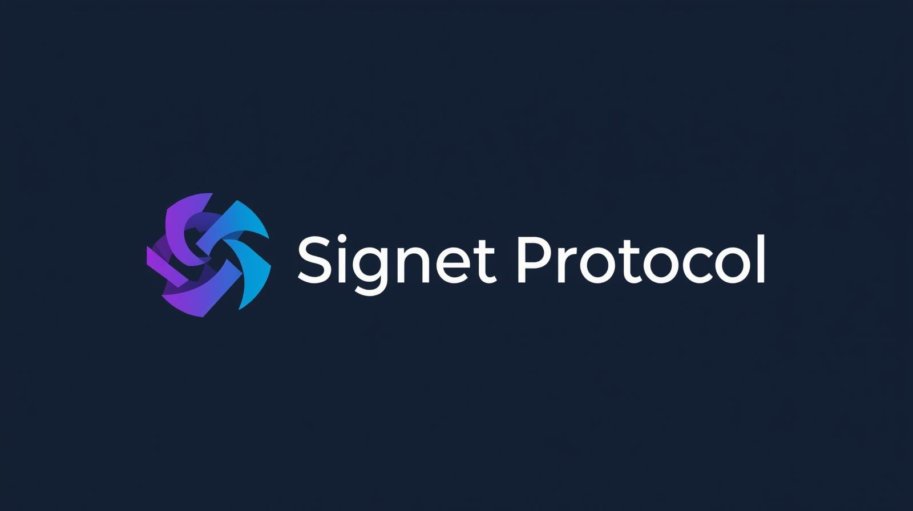

# <div align="center"></div>

# signet-langchain

LangChain integration for the **Signet Protocol** – enabling cryptographically verified AI-to-AI exchanges with receipt chains and exportable signed bundles.

## Features

- Drop-in `CallbackHandler` to automatically route tool / agent actions through Signet
- Automatic trace ID management and receipt chain accumulation
- Optional forwarding webhook support (`forward_url`)
- Chain export when multiple verified exchanges occur
- Runnable wrapper (`SignetRunnable`) for seamless integration with any `Runnable` graph

## Installation

```bash
pip install signet-langchain
```

## Quick Start

```python
from signet_langchain import enable_signet_verification
from langchain.llms import OpenAI
from langchain.chains import LLMChain
from langchain.prompts import PromptTemplate

llm = OpenAI(temperature=0)
prompt = PromptTemplate(
    input_variables=["customer", "amount"],
    template="Create an invoice for {customer} with amount ${amount}. Return as JSON."
)
chain = LLMChain(llm=llm, prompt=prompt)

signet = enable_signet_verification(
    signet_url="https://signet-protocol.fly.dev",
    api_key="YOUR_API_KEY"
)

result = chain.run(customer="Acme Corp", amount="1000", callbacks=[signet])
print(result)
print(f"Verified exchanges: {len(signet.verified_exchanges)}")
```

## API

```python
from signet_langchain import (
    SignetCallbackHandler,
    SignetRunnable,
    enable_signet_verification,
)
```

| Symbol | Description |
|--------|-------------|
| `SignetCallbackHandler` | LangChain callback handler capturing tool outputs & routing to Signet. |
| `SignetRunnable` | Wrap any `Runnable` to automatically attach the callback. |
| `enable_signet_verification` | Convenience factory returning a configured handler. |

### Handler Parameters

| Param | Description | Default |
|-------|-------------|---------|
| `signet_url` | Base URL of Signet Protocol server | required |
| `api_key` | API key (X-SIGNET-API-Key) | required |
| `forward_url` | Optional webhook to forward normalized data | None |
| `tenant` | Logical tenant label for tracing | "langchain" |
| `auto_forward` | Include forward_url in each exchange if provided | True |

## Exporting Chains

If more than one verified exchange occurs in a session, the handler attempts an export via `/v1/receipts/export/{trace_id}` and logs success.

## Versioning

This package aligns with the Signet API frozen spec versions (`docs/api/openapi-*.yaml`). Breaking changes will increment the minor version until stabilizing at 1.x.

## License

Apache 2.0 – see the root repository LICENSE.

## Links

- Signet Protocol Repo: https://github.com/Maverick0351a/signet-protocol
- Stable API Spec: `docs/api/openapi-v1.0.0.yaml`
