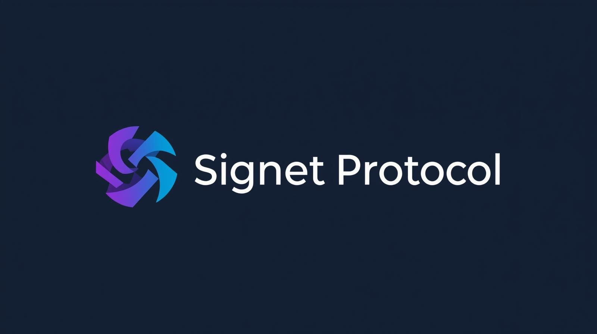

# <div align="center"></div>

# Signet Lens VS Code Extension


Visualize and verify Signet Protocol receipt chains directly inside VS Code with inline provenance metadata.

## Features
* Local integrity verification of receipt chain hash links
* Fetch full chain by trace id from a running Signet server
* Interactive hop visualization (tree + webview)
* Export bundle & copy CID for provenance workflows
* Inline decorations (hash, hop index, status) in JSON
* One-click CID diff (expected vs computed)
* Minimal bundled footprint (dependencies inlined)

## Screenshot
> (Add `images/screenshot.png` and update this section after capturing.)
```
<preview pending>
```

## Branding
The Signet logo above is included from the parent repository `assets/LogoSignet.png`. Use a 128x128 cropped/transparent variant for the marketplace `icon.png` if higher clarity is needed. Replace `icon.png` and bump the extension version to publish the new branding.

## Commands ("Signet Lens" prefix)
* Verify Receipt Chain
* Visualize Receipt Chain
* Copy Bundle CID
* Diff CID
* Open Settings

## Settings
| Setting | Description | Default |
|---------|-------------|---------|
| serverUrl | Base URL of Signet backend | http://localhost:8088 |
| apiKey | API key used for authenticated endpoints | (empty) |
| autoVerify | Auto-verify JSON receipts on focus/change | true |
| showInlineDecorations | Show inline hash / hop metadata | true |
| highlightReceiptFields | Highlight receipt specific fields | true |

## Requirements
Run a Signet Protocol backend (see project README) and obtain an API key configured on the server.

## Publishing (Maintainers)
1. Bump version in `package.json`
2. `npm install` (ensure toolchain present)
3. `npm run package:min` (generates `*.vsix`)
4. `npm run publish` (requires `VSCE_PAT` or interactive PAT)

## Telemetry
This extension does **not** collect telemetry. Any future telemetry will be opt‑in and documented here clearly.

## License
Apache-2.0 © 2025 ODIN Protocol Corporation
